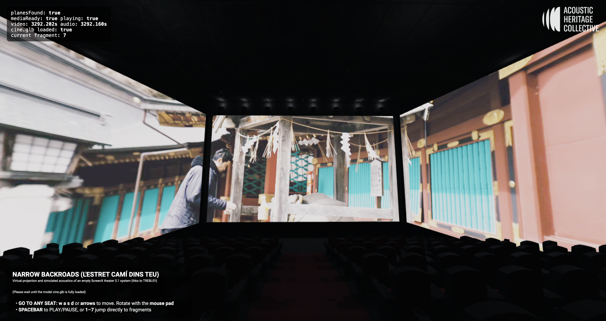

# Narrow Backroads 3D
## L'Estret Camí Dins Teu

**A Virtual ScreenX Cinema Experience with Spatialized 5.1 Audio**



Experience our cinematic poem "Narrow Backroads" in an immersive virtual theater environment with ScreenX triple-screen projection and simulated 5.1 surround sound acoustics.

**Live Experience**: [https://acousticheritagecollective.org/narrowbackroads3d/](https://acousticheritagecollective.org/narrowbackroads3d/)

---

## Concept

**Narrow Backroads** is an immersive web-based virtual cinema that recreates the experience of watching a cinematic poem in a ScreenX theater with a full 5.1 surround sound system. 

**Key Features:**
- **ScreenX Triple-Screen Format**: Three synchronized video screens creating an immersive 270° field of view
- **Spatialized 5.1 Audio**: Six-channel surround sound (L, R, C, LFE, SL, SR) with Web Audio API spatial positioning
- **Virtual Theater Navigation**: First-person movement through a 3D cinema space
- **Interactive Experience**: Choose your seat, explore the space, control playback

---

## Technical Architecture

### Technologies

- **Three.js (r161)**: 3D rendering engine
- **Web Audio API**: Spatial audio processing and 6-channel surround sound
- **GLTFLoader**: 3D model loading (cinema environment)
- **PointerLockControls**: First-person camera controls
- **HTML5 Video**: Multi-screen video synchronization

### System Architecture

```
┌─────────────────────────────────────────────────┐
│          Virtual Theater Environment            │
│  (cine.glb - 3D model with equirectangular bg)  │
└──────────────────┬──────────────────────────────┘
                   │
    ┌──────────────┴──────────────┐
    │                             │
┌───▼────────────────┐  ┌────────▼───────────────┐
│  ScreenX Display   │  │   5.1 Audio System     │
│                    │  │                        │
│ ┌────────────────┐ │  │ ┌──────────────────┐   │
│ │  Left Screen   │ │  │ │ Channel Splitter │   │
│ │  (1/3 video)   │ │  │ │   (6 channels)   │   │
│ └────────────────┘ │  │ └────────┬─────────┘   │
│                    │  │          │             │
│ ┌────────────────┐ │  │   ┌──────▼──────┐      │
│ │ Center Screen  │ │  │   │   Panners   │      │
│ │  (1/3 video)   │ │  │   │  (L/R/C/SL  │      │
│ └────────────────┘ │  │   │   /SR)      │      │
│                    │  │   └─────────────┘      │
│ ┌────────────────┐ │  │                        │
│ │  Right Screen  │ │  │   ┌─────────────┐      │
│ │  (1/3 video)   │ │  │   │  LFE Node   │      │
│ └────────────────┘ │  │   │ (Lowpass)   │      │
│                    │  │   └─────────────┘      │
│  Synced playback   │  │                        │
└────────────────────┘  └────────────────────────┘
         │                         │
         └──────────┬──────────────┘
                    │
         ┌──────────▼───────────┐
         │  User Controls       │
         │  - WASD/Arrows: Move │
         │  - Mouse: Look       │
         │  - Space: Play/Pause │
         │  - 1-7: Chapters     │
         └──────────────────────┘
```

---

##  ScreenX Implementation

### Video Configuration

**Source**: `stitched-LCR-final.mp4`
- Single wide video file containing all three screens stitched horizontally
- Split into three synchronized video textures for Left, Center, Right screens

### Screen Geometry

```javascript
// Screen dimensions
Screen Width: 21 units
Screen Height: 12 units

// Center screen position
Position: (-0.2, 7.4, 5.0)
Rotation: 180° (facing audience)

// Side screens
Angle: 77° from center
Offset: Screen width * 0.5 from center edges
```

### Screen Layout (Top View)

```
           [Audience Position]
                  ↓
                  ●
                  │
                  │
        ┌─────────┼─────────┐
        │         │         │
    ┌───┴───┐     │     ┌───┴───┐
    │ Left  │     │     │ Right │
    │Screen │     │     │Screen │
    │       │     │     │       │
    └───┬───┘     │     └───┬───┘
        │    ┌────┴────┐    │
        │    │ Center  │    │
        │    │ Screen  │    │
        │    │         │    │
        │    └─────────┘    │
        │                   │
        └───────────────────┘
         270° Field of View
```

---

##  5.1 Surround Sound System

### Audio Configuration

**Source**: `5p1.m4a`
- Single 6-channel AAC file
- Channel order: L, R, C, LFE, SL, SR

### Spatial Audio Positioning

All channels (except LFE) use Web Audio API `PannerNode` for 3D spatial positioning:

```javascript
Speaker Positions (x, y, z):
┌─────────┬──────────────────────┬─────────────────┐
│ Channel │ Position             │ Description     │
├─────────┼──────────────────────┼─────────────────┤
│ L       │ (12, 7, 5)           │ Left Front      │
│ R       │ (-12, 7, 5)          │ Right Front     │
│ C       │ (0.2, 7.4, 5.0)      │ Center Front    │
│ LFE     │ (0.2, 3.0, 5.0)      │ Subwoofer       │
│ SL      │ (14, 9, -12)         │ Surround Left   │
│ SR      │ (-14, 9, -12)        │ Surround Right  │
└─────────┴──────────────────────┴─────────────────┘
```

### Audio Processing Chain

```
6-Channel AAC File (5p1.m4a)
          ↓
   [MediaElementSource]
          ↓
   [ChannelSplitter (6)]
          ↓
     ┌────┴────┬────┬────┬────┬────┐
     │    │    │    │    │    │
    [L] [R] [C][LFE][SL][SR]
     │    │    │    │    │    │
  [Panner Nodes for spatial positioning]
     │    │    │   [Lowpass Filter]
     │    │    │    │    │    │
     └────┴────┴────┴────┴────┘
              ↓
        [AudioContext]
```

**LFE Processing**: 
- Lowpass filter applied to isolate low frequencies
- Non-positional (omnidirectional)

---

##  Project Structure

```
narrowbackroads3d/
├── index.html              # Main HTML entry point
├── main.js                 # Three.js application & audio engine
├── cine.glb               # 3D cinema environment model
├── bgeq.jpg               # Equirectangular background texture
├── cover.jpg              # Screen placeholder/cover image
├── Logo.png               # Project logo overlay
├── ahc.ico                # Favicon
├── stitched-LCR-final.mp4 # Triple-screen video (stitched)
└── 5p1.m4a                # 6-channel surround audio
```

---

##  User Controls

### Navigation
- **W / ↑**: Move forward
- **A / ←**: Move left
- **S / ↓**: Move backward
- **D / →**: Move right
- **Mouse**: Look around (pointer lock required)

### Playback
- **SPACEBAR**: Play/Pause toggle
- **1-7**: Jump to chapter markers

### Chapter Markers
```
1 → 0:00:00  (Start)
2 → 0:00:32
3 → 0:07:04
4 → 0:17:19
5 → 0:28:17
6 → 0:32:29
7 → 0:44:09
8 → 0:54:17
```

---

##  Getting Started

### Local Development

1. **Clone or download the project files**

2. **Serve with a local web server** (required for CORS and ES6 modules):

```bash
# Option 1: Python
python3 -m http.server 8000

# Option 2: Node.js
npx http-server -p 8000

# Option 3: VS Code Live Server extension
```

3. **Open in browser**:
```
http://localhost:8000
```

4. **Click anywhere** to activate pointer lock controls

5. **Navigate** to the center of the theater and press **SPACEBAR** to begin

### Browser Requirements

- **Modern browser** with WebGL 2.0 support
- **Chrome/Edge** recommended for best audio performance
- **Hardware acceleration** enabled
- **Sufficient GPU memory** for 3D rendering + video textures

---

##  Customization

### Adjusting Screen Layout

In `main.js`, modify screen geometry:

```javascript
// Screen dimensions
const screenWidth = 21;   // Adjust width
const screenHeight = 12;  // Adjust height

// Center position
const cx = -0.2;  // X position
const cy = 7.4;   // Y position (height)
const cz = 5;     // Z position (distance)

// Side screen angle
const angle = THREE.MathUtils.degToRad(77);  // Adjust angle
```

### Adjusting Audio Positions

Modify speaker positions in `AUDIO_POSITIONS` object:

```javascript
const AUDIO_POSITIONS = {
  L:  new THREE.Vector3(12, 7, 5),    // Left speaker
  R:  new THREE.Vector3(-12, 7, 5),   // Right speaker
  C:  new THREE.Vector3(0.2, 7.4, 5.0), // Center
  // ... etc
};
```

### Camera & Movement

```javascript
// Initial camera position
camera.position.set(0, 2, 0);  // X, Y, Z

// Field of view
camera = new THREE.PerspectiveCamera(
  90,  // FOV in degrees
  window.innerWidth / window.innerHeight,
  0.1,   // Near clipping plane
  5000   // Far clipping plane
);
```

---

##  Technical Details

### Video Synchronization

All three screens use the same HTML5 video element with different texture offsets:

```javascript
videoTextures = {
  left: new THREE.VideoTexture(videoElem),
  center: new THREE.VideoTexture(videoElem),
  right: new THREE.VideoTexture(videoElem)
};

// Each texture uses offset/repeat to show different portions
// of the stitched video file
```

### Audio Channel Splitting

```javascript
// Create channel splitter for 6 channels
splitter = audioContext.createChannelSplitter(6);

// Connect each channel to its panner node
for (let i = 0; i < 6; i++) {
  splitter.connect(pannerNodes[channelName], i, 0);
}
```

### Performance Optimizations

- **Lazy loading**: 3D model loaded asynchronously
- **Texture caching**: Video textures reused across screens
- **Raycasting**: Used for collision detection (optional)
- **Debug overlay**: Toggle for development monitoring

---

##  Troubleshooting

### Video doesn't play

**Cause**: Browsers require user interaction for autoplay

**Solution**: Click to activate pointer lock, then press SPACEBAR

### Audio channels not spatial

**Cause**: Web Audio API requires HTTPS or localhost

**Solution**: Ensure you're serving via HTTPS or localhost

### Model not loading

**Cause**: CORS restrictions or slow connection

**Solution**: 
- Check browser console for errors
- Verify GLB file path is correct
- Wait for "cine.glb loaded: true" in debug overlay

### Screens show only black/cover image

**Cause**: Video file not loaded or planes not found

**Solution**:
- Check that `stitched-LCR-final.mp4` exists
- Verify debug overlay shows `planesFound: true`
- Check browser console for video loading errors

### Poor performance / lag

**Cause**: GPU limitations or large file sizes

**Solutions**:
- Reduce video resolution
- Lower screen geometry complexity
- Disable shadows: `renderer.shadowMap.enabled = false`
- Lower tone mapping exposure

---

##  Debug Overlay

The debug overlay (top-left corner) displays real-time status:

```
planesFound: true/false       # Screens detected
mediaReady: true/false        # Video/audio loaded
playing: true/false           # Playback state
video: XX.XXXs               # Current video time
audio: XX.XXXs               # Current audio time
cine.glb loaded: true/false  # 3D model loaded
current fragment: 0-7        # Active chapter
```

---

##  Deployment

### Recommended Hosting

1. **Static hosting** (Netlify, Vercel, GitHub Pages)
2. **CDN** for media files (video/audio are large)
3. **HTTPS required** for Web Audio API

### File Size Considerations

- `stitched-LCR-final.mp4`: Largest file (multi-screen video)
- `5p1.m4a`: 6-channel audio file
- `cine.glb`: 3D environment model

**Optimization tips:**
- Compress video with H.264 (recommended bitrate: 5-10 Mbps)
- Use AAC for audio (already efficient for multi-channel)
- Optimize GLB file with Blender or glTF tools
- Consider progressive loading for video

---

##  Use Cases

- **Film festivals**: Virtual screenings
- **Art installations**: Immersive poetry experiences
- **Education**: Demonstrating ScreenX technology
- **Archival**: Preserving cinematic work in virtual format
- **Accessibility**: Remote access to theatrical experiences

---

##  Future Enhancements

### Potential Improvements

- **VR headset support** (WebXR API)
- **Multiple seating presets** (best audio positions)
- **Quality selector** (HD/SD video toggle)
- **Subtitle support** (WebVTT tracks)
- **Social features** (multi-user theaters)
- **Analytics** (viewing patterns, seat preferences)
- **Accessibility** (audio descriptions, captions)

### Advanced Audio Features

```javascript
// Potential additions:
// - Room acoustics simulation (reverb)
// - Dynamic range compression
// - Dolby Atmos object-based audio
// - Binaural rendering for headphones
```

---

##  Credits

**Project**: Narrow Backroads (L'Estret Camí Dins Teu)  
**Organization**: Acoustic Heritage Collective  
**Website**: [acousticheritagecollective.org](https://acousticheritagecollective.org)

**Technology Stack**:
- Three.js by Mr.doob and contributors
- Web Audio API
- ScreenX format concept
- TREBLE audio processing

---

##  License

[Your license information here]

---

##  Acknowledgments

Special thanks to **TREBLE** for audio processing support.

---

**Experience the virtual cinema**: [https://acousticheritagecollective.org/narrowbackroads3d/](https://acousticheritagecollective.org/narrowbackroads3d/)

---

*Last updated: February 2026*
